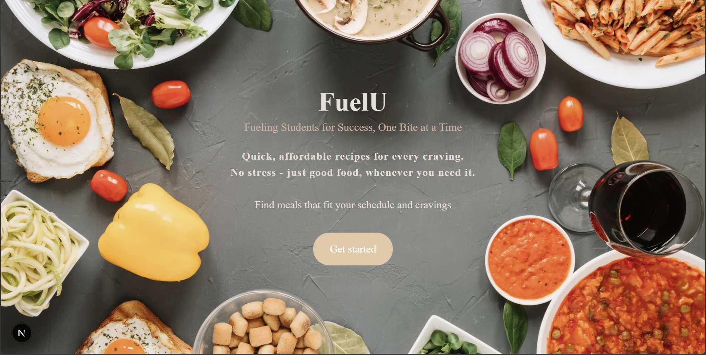
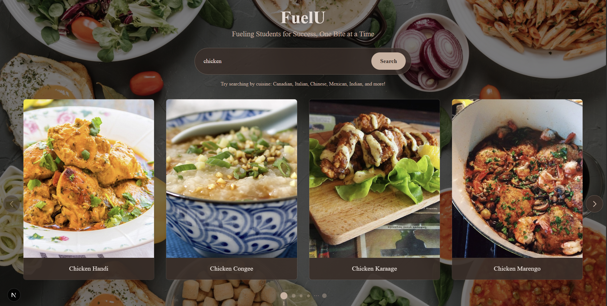
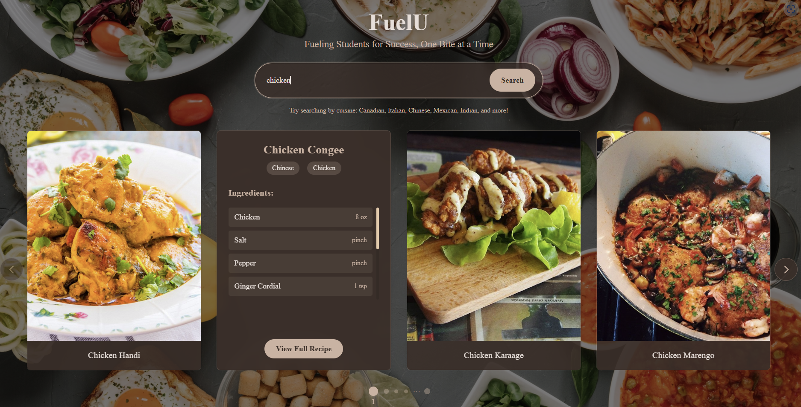
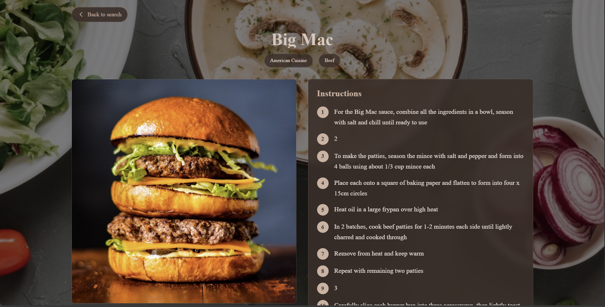

# FuelU 🍽️

**Fueling Students for Success, One Bite at a Time.**

FuelU is a web app that helps college students cook affordable, approachable meals at home. Our mission is to make healthy eating more accessible by providing easy-to-follow recipes that inspire confidence in the kitchen—reducing reliance on takeout and supporting student wellness.

---

## 🚀 Features

- 🔍 **Search Recipes:** Browse and discover simple meals from a variety of cuisines.
- 🌎 **Global Inspiration:** Access a growing collection of international recipes.
- 🖼️ **User-Friendly UI:** Clean design with intuitive components like SearchBar and ImageCard.
- 🛠️ **API Integration:** Recipes fetched dynamically from a third-party API.

---

## 🎨 Screenshots

---

## 💻 Built With

- **Next.js** – Frontend framework
- **React** – UI library
- **CSS Modules** – Styling
- **The MealDB API** – Recipe data source

---

## 🛠️ Getting Started

Go to this link:

https://fuel-u.vercel.app/

---

## 🙌 Our Team
- Arun Sisarran 
- Tiffany Calle
- Nava Nizard
- Fatama Raytha

---

## ⚡ Inspiration
We built FuelU during the CUNY HunterHacks Hackathon to address the challenges students face with time, money, and access to healthy food. Even small steps toward home cooking can make a big difference in wellness and financial independence.

---

## 📈 What's Next
- Enhance filtering and sorting features

- Expand recipe data with more student-focused tags

- Add user accounts & personalization
---
## 📄 License
Apache License